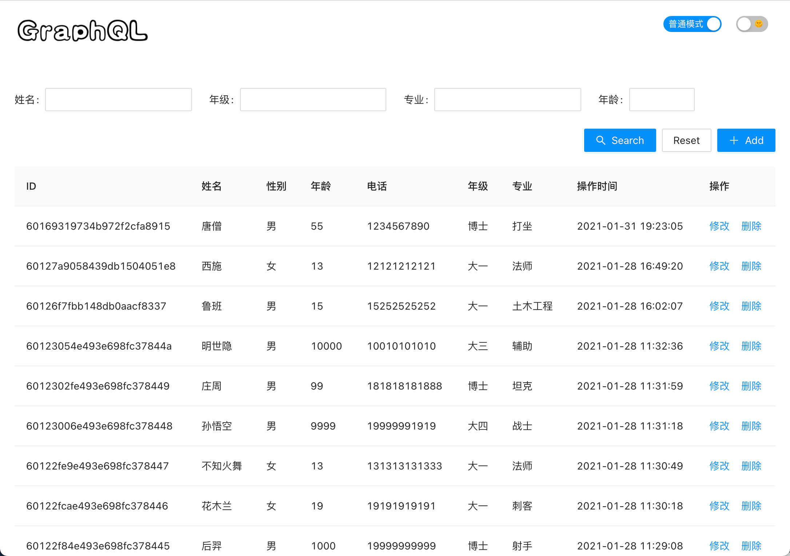
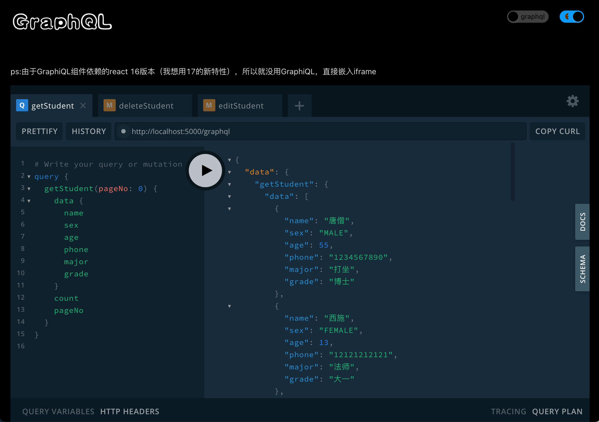

# GraphQL-Koa-Mongodb

一个增删改查的项目，用来学习GraphQL，分为服务端，在server里，用的GraphQL，Koa，Mongodb；页面在view里，用react，antd写的.  





启动

```text
# 先启动Mongodb
mongod --dbpath ~/data/db

# 启动服务端
cd server
npm i
npm start

# 前端
cd ../view
npm i
npm start
```

- [GraphQL-Koa-Mongodb](#graphql-koa-mongodb)
  - [1. GraphQL类型](#1-graphql类型)
    - [1.1. 标量类型（Scalar Types）](#11-标量类型scalar-types)
    - [1.2. 枚举类型（Enumeration Types）](#12-枚举类型enumeration-types)
    - [1.3. 列表和非空（Lists and Non-Null）](#13-列表和非空lists-and-non-null)
  - [2. apollo-server-koa](#2-apollo-server-koa)

## 1. GraphQL类型

### 1.1. 标量类型（Scalar Types）

GraphQL 自带一组默认标量类型：  

- Int：有符号 32 位整数。
- Float：有符号双精度浮点值。
- String：UTF‐8 字符序列。
- Boolean：true 或者 false。
- ID：ID 标量类型表示一个唯一标识符，通常用以重新获取对象或者作为缓存中的键。ID 类型使用和 String 一样的方式序列化；然而将其定义为 ID 意味着并不需要人类可读型。  

默认情况下，每个类型都是可以为空的 —— 意味着所有的标量类型都可以返回 null。  
使用感叹号可以标记一个类型不可为空，如 String! 表示非空字符串。  

如果是列表类型，使用方括号将对应类型包起来，如 [Int] 就表示一个整数列表。  

代码路径：server/graphql/scheme.js  

```js
const { gql } = require("apollo-server-koa");

const typeDefs = gql`
  type Time {
    createdAt: String
    updatedAt: String
  }
  type Student {
    name: String
    sex: String
    age: Int
    phone: String
    major: String
    grade: String
    meta: Time
    _id: ID
  }
  type StudentResult {
    data: [Student]
    count: Int
    pageNo: Int
    pageSize: Int
  }
`;
```

自定义标量类型的方式。例如，我们可以定义一个 Date 类型：

```js
scalar Date
```

### 1.2. 枚举类型（Enumeration Types）

也称作枚举（enum），枚举类型是一种特殊的标量，它限制在一个特殊的可选值集合内。这让你能够：  

1. 验证这个类型的任何参数是可选值的的某一个.  
2. 与类型系统沟通，一个字段总是一个有限值集合的其中一个值。  

```js
enum Episode {
  NEWHOPE
  EMPIRE
  JEDI
}
```

这表示无论我们在 schema 的哪处使用了 Episode，都可以肯定它返回的是 NEWHOPE、EMPIRE 和 JEDI 之一。  

### 1.3. 列表和非空（Lists and Non-Null）

使用了一个 String 类型，并通过在类型名后面添加一个感叹号!将其标注为非空。这表示我们的服务器对于这个字段，总是会返回一个非空值，如果它结果得到了一个空值，那么事实上将会触发一个 GraphQL 执行错误，以让客户端知道发生了错误。

```js
type Character {
  name: String!
  appearsIn: [Episode]!
}
```

List表示这个字段会返回这个类型的数组。在 GraphQL schema 语言中，我们通过将类型包在方括号（[ 和 ]）中的方式来标记列表。  

非空和列表修饰符可以组合使用。例一个非空字符串的数组：

```js
myField: [String!]
// 这表示数组本身可以为空，但是其不能有任何空值成员。
myField: null // 有效
myField: [] // 有效
myField: ['a', 'b'] // 有效
myField: ['a', null, 'b'] // 错误
```

一个不可为空的字符串数组：

```js
myField: [String]!
// 这表示数组本身不能为空，但是其可以包含空值成员：
myField: null // 错误
myField: [] // 有效
myField: ['a', 'b'] // 有效
myField: ['a', null, 'b'] // 有效
```

## 2. apollo-server-koa

```js
import koa from 'koa'; // koa@2
import koaRouter from 'koa-router';
import koaBody from 'koa-bodyparser';
import { graphqlKoa } from 'apollo-server-koa';

const app = new koa();
const router = new koaRouter();
const PORT = 3000;

// koaBody is needed just for POST.
app.use(koaBody());

router.post('/graphql', graphqlKoa({ schema: myGraphQLSchema }));
router.get('/graphql', graphqlKoa({ schema: myGraphQLSchema }));

app.use(router.routes());
app.use(router.allowedMethods());
app.listen(PORT);
```